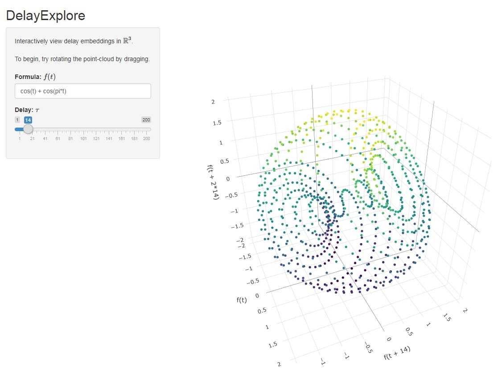

# DelayExplore
**Author**: Michael Duprey

This lightweight Shiny application provides interactively view delay embeddings in <strong>R</strong>3 for simple equations.

## Dependencies
* Shiny
* Plotly
* fractal