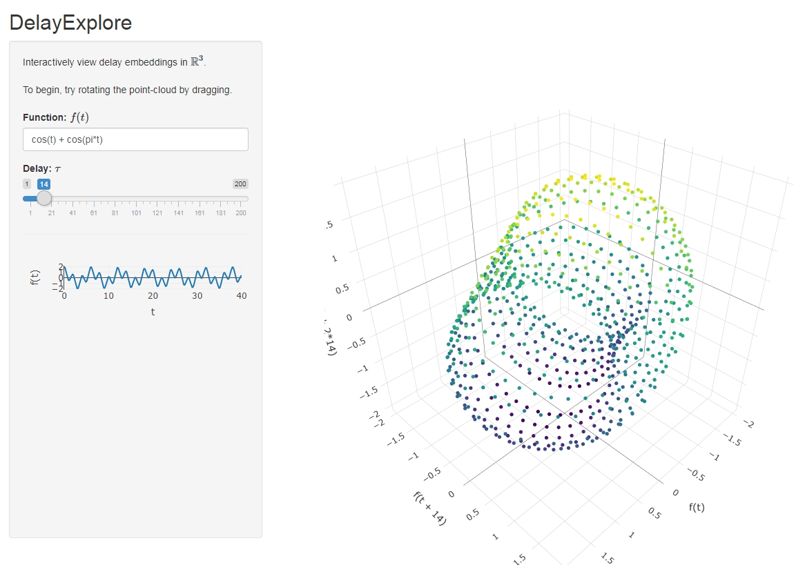

# DelayExplore
**Author**: Michael Duprey

This lightweight Shiny application allows for interactively viewing simple equations as delay embeddings in <strong>R</strong>3.

## Dependencies
* Shiny
* Plotly
* fractal